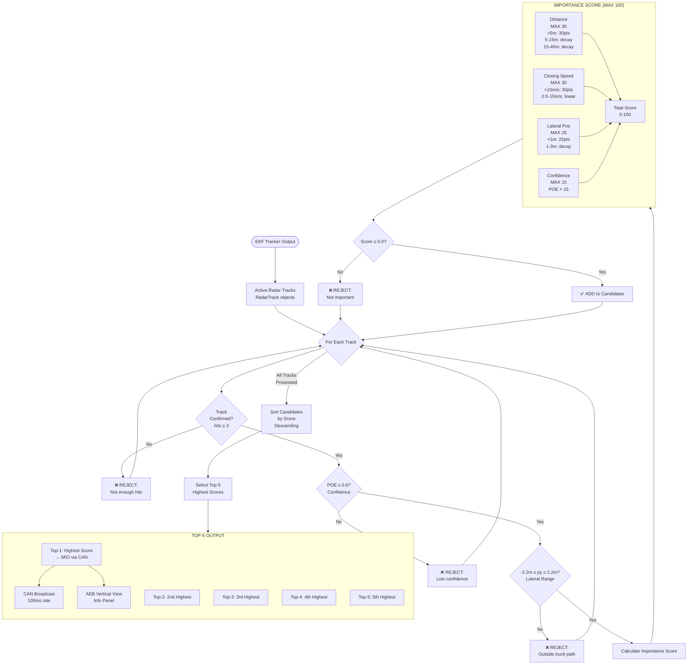

```mermaid
flowchart TB
    Start([EKF Tracker Output]) --> Tracks[Active Radar Tracks<br/>RadarTrack objects]
    
    Tracks --> Loop{For Each Track}
    
    Loop --> Filter1{Track<br/>Confirmed?<br/>hits ≥ 3}
    Filter1 -->|No| Reject1[❌ REJECT:<br/>Not enough hits]
    Filter1 -->|Yes| Filter2
    
    Filter2{POE ≥ 0.6?<br/>Confidence}
    Filter2 -->|No| Reject2[❌ REJECT:<br/>Low confidence]
    Filter2 -->|Yes| Filter3
    
    Filter3{-2.2m ≤ py ≤ 2.2m?<br/>Lateral Range}
    Filter3 -->|No| Reject3[❌ REJECT:<br/>Outside truck path]
    Filter3 -->|Yes| CalcScore
    
    CalcScore[Calculate Importance Score]
    
    CalcScore --> ScoreBreakdown
    
    subgraph ScoreBreakdown["IMPORTANCE SCORE (MAX 100)"]
        direction LR
        
        Dist[Distance<br/>MAX 30<br/><5m: 30pts<br/>5-15m: decay<br/>15-40m: decay]
        Speed[Closing Speed<br/>MAX 30<br/>>10m/s: 30pts<br/>0.5-10m/s: linear]
        Lat[Lateral Pos<br/>MAX 25<br/><1m: 25pts<br/>1-3m: decay]
        Conf[Confidence<br/>MAX 15<br/>POE × 15]
        
        Dist --> Sum
        Speed --> Sum
        Lat --> Sum
        Conf --> Sum
        
        Sum[Total Score<br/>0-100]
    end
    
    ScoreBreakdown --> Filter4{Score ≥ 5.0?}
    Filter4 -->|No| Reject4[❌ REJECT:<br/>Not important]
    Filter4 -->|Yes| AddCandidate[✅ ADD to Candidates]
    
    Reject1 --> Loop
    Reject2 --> Loop
    Reject3 --> Loop
    Reject4 --> Loop
    AddCandidate --> Loop
    
    Loop -->|All Tracks<br/>Processed| Sort[Sort Candidates<br/>by Score<br/>Descending]
    
    Sort --> Select[Select Top 5<br/>Highest Scores]
    
    Select --> Output
    
    subgraph Output["TOP-5 OUTPUT"]
        direction TB
        Top1[Top-1: Highest Score<br/>→ MIO via CAN]
        Top2[Top-2: 2nd Highest]
        Top3[Top-3: 3rd Highest]
        Top4[Top-4: 4th Highest]
        Top5[Top-5: 5th Highest]
        
        Top1 --> CAN[CAN Broadcast<br/>100ms rate]
        Top1 --> Display[AEB Vertical View<br/>Info Panel]
    end
```
